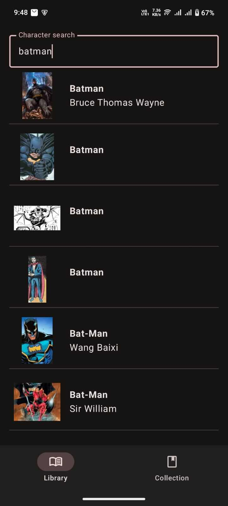
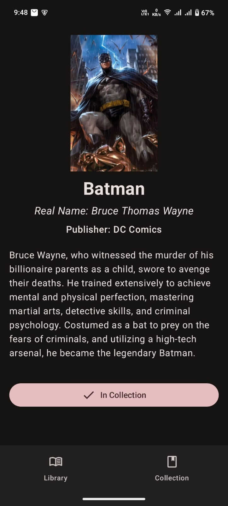
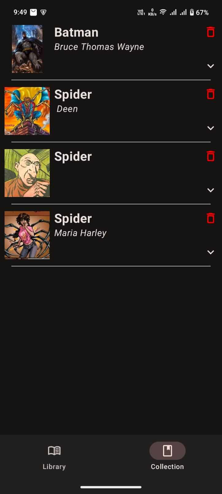
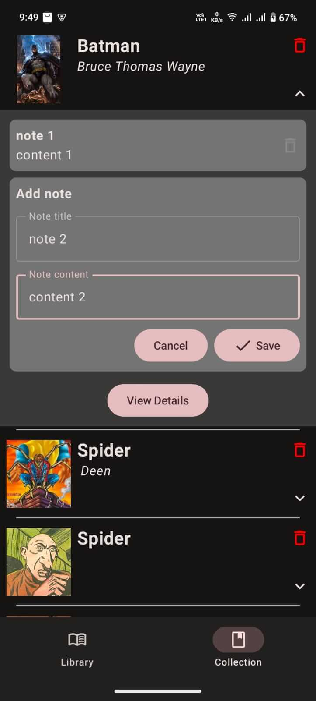

# 🚀 HeroArchive

**HeroArchive** is a professional-grade, modern Android application built to showcase the best of Android development practices. Leveraging the **Comicvine API**, it provides a seamless experience for exploring thousands of comic characters, managing a personal database, and recording custom insights—all powered by a cutting-edge tech stack.

[](https://kotlinlang.org)
[](https://developer.android.com/jetpack/compose)
[](https://dagger.dev/hilt/)
[](https://developer.android.com/topic/architecture)

---

## 📸 Preview

<p align="center">
  
  
  
  
</p>

---

## ✨ Key Features

- 🔍 **Dynamic Character Discovery**: Search the global Comicvine database with optimized, high-performance API queries.
- 💾 **Offline-First Collection**: Persist favorite characters locally using **Room Database** for instant access without internet.
- 📓 **Personalized Annotations**: A custom note-taking system for every hero, allowing users to save personal insights and lore.
- 📡 **Intelligent Network Monitoring**: A reactive connectivity system that gracefully handles network state changes.
- ⚡ **Optimized Performance**: Debounced search inputs and efficient state management for a lag-free experience.
- 🎨 **Material 3 Design**: A beautiful, modern interface built entirely with **Jetpack Compose**.

---

## 🛠 Tech Stack & Architecture

This project is a demonstration of **industry-standard architecture** and **modern libraries**.

- **Architecture**: Clean Architecture (Data, Domain, Presentation layers)
- **UI Framework**: [Jetpack Compose](https://developer.android.com/jetpack/compose) with Material 3
- **Dependency Injection**: [Hilt](https://dagger.dev/hilt/) (Dagger based)
- **Local Storage**: [Room Persistence Library](https://developer.android.com/training/data-storage/room) with KSP
- **Networking**: [Retrofit 3](https://square.github.io/retrofit/) & [OkHttp Logging Interceptor](https://square.github.io/okhttp/)
- **Image Handling**: [Coil](https://coil-kt.github.io/coil/) (Coroutines-based image loader)
- **Reactive Programming**: [Kotlin Coroutines](https://kotlinlang.org/docs/coroutines-overview.html) & [Flow](https://kotlinlang.org/docs/flow.html)
- **Build System**: Kotlin DSL (build.gradle.kts) & Version Catalog (toml)

---

## 🚀 Getting Started

### Prerequisites
- Android Studio Ladybug+
- JDK 17+
- A [Comicvine API Key](https://comicvine.gamespot.com/api/)

### Installation

1. **Clone the repository**:
   ```sh
   git clone https://github.com/your-username/hero-archive.git
   ```

2. **Secure API Configuration**:
   Create `apikey.properties` in the project root:
   ```properties
   COMICVINE_API_KEY=your_api_key_here
   ```

3. **Launch**:
   Sync with Gradle and deploy to your device or emulator.

---

## 📂 Architecture Overview

The project is structured according to **Clean Architecture** principles to ensure testability and scalability:

```
com.example.cosmicslibrary
├── data           # Remote API sources & Local Room implementations
├── di             # Hilt Dependency Injection modules
├── domain         # Business logic, Models & Repository interfaces
├── presentation   # UI Layer (Compose Screens & ViewModels)
├── util           # Networking & Connectivity utilities
└── ui.theme       # Design system and Material 3 definitions
```

---

## 🤝 Contributing

This is an open-source project. If you'd like to improve the architecture, add features, or fix bugs, feel free to open a Pull Request!

---